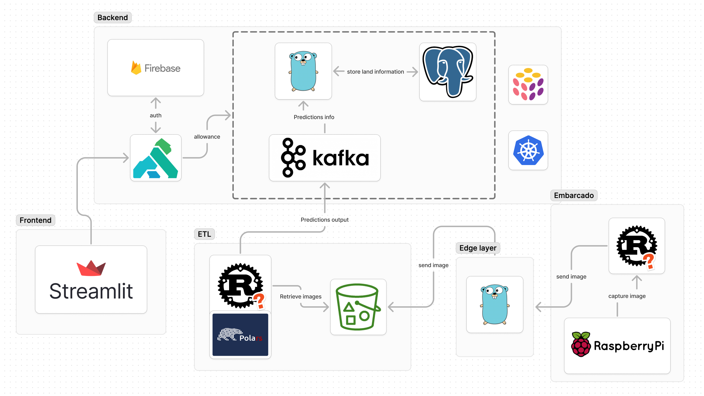

# Arquitetura da Solução

Este projeto tem como objetivo capturar imagens de árvores em diferentes áreas utilizando drones, processar essas imagens através de um modelo de visão computacional (YOLO) e retornar a quantidade de árvores identificadas em cada imagem.

## Visão Geral

A arquitetura da solução é dividida em várias camadas e componentes que interagem para fornecer uma solução robusta e escalável. A seguir, descrevemos os principais componentes e o fluxo de dados entre eles.

## Camadas e Componentes

### 1. **Frontend**
   - **Streamlit**: Utilizado para construir a interface gráfica do usuário (GUI), onde os usuários podem visualizar e interagir com os resultados. Streamlit é responsável por receber entradas do usuário e exibir os resultados das análises feitas pelo modelo.

### 2. **Backend**
   - **Firebase**: Responsável pela autenticação dos usuários que acessam a aplicação.
   - **Kong**: Atua como uma API Gateway, gerenciando o tráfego de entrada, assegurando a segurança e gerenciando o roteamento de requisições entre os serviços.
   - **Kafka**: Utilizado como sistema de mensageria, garantindo a escalabilidade e a robustez na comunicação entre os serviços. Após a execução do modelo YOLO, os resultados são enviados para Kafka para evitar sobrecarregar o banco de dados.
   - **PostgreSQL**: Base de dados utilizada para armazenar os resultados finais das previsões feitas pelo modelo, incluindo detalhes das áreas de terra analisadas. O armazenamento é realizado após os resultados serem processados pelo serviço que consome as mensagens da fila Kafka.

### 3. **ETL (Extract, Transform, Load)**
   - **Polars**: Biblioteca de manipulação de dados usada para o processamento eficiente de grandes volumes de dados. Aqui, as imagens são processadas e transformadas antes de serem enviadas para o modelo de previsão.
   - **Rust**: Utilizado para construir pipelines de ETL robustos e de alto desempenho. O pipeline em Rust busca as imagens armazenadas no bucket S3, processa essas imagens e executa o modelo YOLO para identificar as árvores.

### 4. **Edge Layer**
   - **Go**: Linguagem utilizada para criar a camada de borda que se comunica diretamente com dispositivos embarcados e com o pipeline de ETL. Esta camada recebe as imagens capturadas pelos drones e as envia para o pipeline de processamento.

### 5. **Embarcado**
   - **Raspberry Pi**: Dispositivo embarcado utilizado para capturar as imagens no campo. Ele se comunica com a camada de borda para enviar as imagens capturadas.
   - **Rust**: Também utilizado no Raspberry Pi para gerenciar a captura de imagens e a comunicação com a camada de borda. A escolha do Rust deve-se ao seu alto desempenho e controle de baixo nível sobre o hardware.

## Fluxo de Dados

1. **Captura de Imagem**: O drone, equipado com um Raspberry Pi, captura as imagens das áreas de interesse. Essas imagens são processadas pelo dispositivo Raspberry Pi e enviadas para a camada de borda.
2. **Envio para ETL**: A camada de borda (Go) recebe as imagens e as envia para o pipeline de ETL.
3. **Processamento ETL e Execução do Modelo YOLO**: As imagens são processadas utilizando Polars e Rust. Em seguida, o modelo YOLO é executado para identificar as árvores nas imagens.
4. **Envio para Kafka**: Os resultados das previsões feitas pelo YOLO são enviados para a fila Kafka para evitar sobrecarregar o banco de dados.
5. **Armazenamento no Banco de Dados**: Um serviço consome as mensagens da fila Kafka e armazena os resultados no banco de dados PostgreSQL.
6. **Exibição dos Resultados**: O frontend (Streamlit) exibe a quantidade de árvores identificadas em cada área analisada, com base nas previsões armazenadas.

## Considerações Finais

Esta arquitetura foi desenhada para garantir a escalabilidade, segurança e eficiência no processamento e análise das imagens capturadas por drones. O uso de tecnologias como Rust, Go, Kafka, PostgreSQL e do modelo YOLO assegura que o sistema possa lidar com grandes volumes de dados e requisições em tempo real, enquanto gerencia eficientemente o fluxo de dados para evitar sobrecargas.
