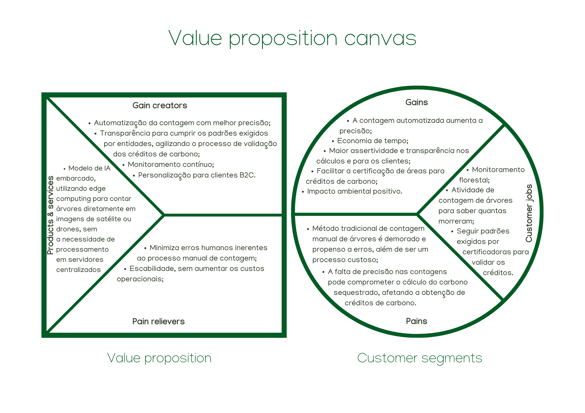

# Value Proposition Canvas

O Value Proposition Canvas é uma ferramenta estratégica que detalha a proposta de valor de um produto ou serviço em relação aos desejos e necessidades dos clientes. É composto por duas seções principais: Perfil do Cliente e Mapa de Valor.

## Perfil do Cliente

Este segmento foca em compreender o cliente através de três aspectos:

- **Dores**: Identifica os desafios e problemas enfrentados pelos clientes.
  
  - Ineficiência e lentidão: O método tradicional de contagem manual de árvores é demorado, ineficiente e propenso a erros;
  - Escalabilidade limitada: A contagem manual não é viável para grandes áreas florestais, limitando a capacidade de monitoramento em maior escala;
  - Imprecisão: A falta de precisão nas contagens pode comprometer o cálculo do carbono sequestrado, afetando a obtenção de créditos de carbono;
  - Custo elevado: O processo manual de contagem pode ser caro devido à mão de obra intensiva necessária.

- **Ganhos**: Capta os benefícios e resultados esperados pelos clientes.

  - Precisão aumentada: A contagem automatizada aumenta a precisão na identificação e quantificação das árvores;
  - Economia de tempo: O processo se torna muito mais rápido, permitindo análises em tempo real/quase real;
  - Bioeconomia: A solução permitirá a aplicação em grandes áreas, facilitando o monitoramento das florestas, com ênfase em árvores que podem trazer retornos bioeconômicos.;
  - Impacto ambiental positivo: Contribuição direta para a conservação das florestas e mitigação das mudanças climáticas.
  
- **Tarefas do Cliente**: As atividades que os clientes realizam hoje.

  - Contagem de árvores: Atividade central para calcular o 'sequestro' de carbono e obter créditos de carbono;
  - Monitoramento florestal: Supervisão contínua das áreas florestais para conservação e certificação ambiental;
  - Certificação de crédito de carbono: Seguir padrões exigidos por certificadoras, como a VERRA, para validar os créditos de carbono.

## Mapa de Valor

Esta seção aborda como a oferta da empresa se alinha às expectativas do cliente:

- **Criadores de Ganhos**: Explica como a oferta gera benefícios esperados pelos clientes.
  - Automação e precisão: A IA automatiza a contagem com alta precisão, garantindo que os cálculos sejam mais confiáveis;
  - Transparência para certificação: Facilita o cumprimento dos padrões exigidos por entidades certificadoras, agilizando o processo de validação dos créditos de carbono, com dados transparentes e auditáveis;
  - Personalização e usabilidade: A solução oferece uma experiência de usuário intuitiva e personalizada para clientes B2C.
  - Monitoramento contínuo: Proporciona um fluxo contínuo de dados para monitoramento e relatórios em larga escala.
  
- **Aliviadores de Dores**: Descreve as formas de mitigar os problemas identificados no perfil do cliente.
  - Redução de erros: Minimiza os erros humanos inerentes ao processo manual de contagem.
  - Escalabilidade de operações: Permite a aplicação da solução em diferentes regiões, sem aumentar significativamente os custos operacionais.
  - Custos reduzidos: A automação diminui a necessidade de mão de obra intensiva, reduzindo os custos associados à contagem manual.
  
- **Produtos e Serviços**: Enumera as soluções fornecidas para atender às necessidades do cliente.
  - Desenvolvimento de um modelo de IA embarcado que utiliza computação de borda (edge computing) para detectar e contar árvores diretamente em imagens de satélite ou drones, sem a necessidade de processamento em servidores centralizados. Esta abordagem facilita a integração com diferentes sistemas através de APIs e interfaces de usuário, permitindo o uso eficiente da ferramenta por equipes diversas. Além disso, o modelo embarcado oferece alta escalabilidade e permite testes e ajustes contínuos em tempo real, garantindo sua eficácia em diferentes ambientes e condições.

Por fim a sua aplicação segue a lógica:

1. Analisar o lado do Perfil do Cliente para discernir tarefas, dores e ganhos dos clientes.
2. Detalhar no Mapa de Valor os produtos e serviços oferecidos, como aliviam as dores e proporcionam ganhos.
3. Avaliar o alinhamento entre o Mapa de Valor e o Perfil do Cliente, buscando uma correspondência ótima entre a oferta e as necessidades dos clientes.

