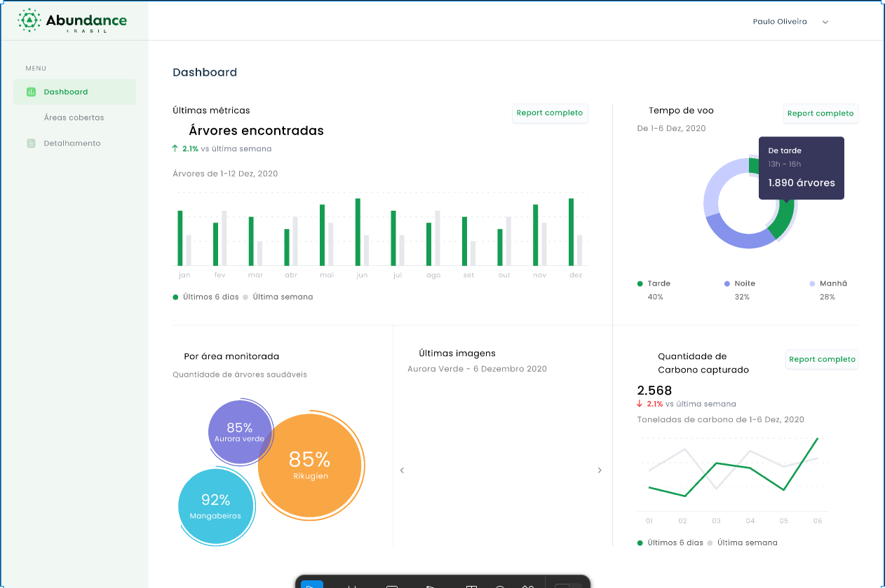
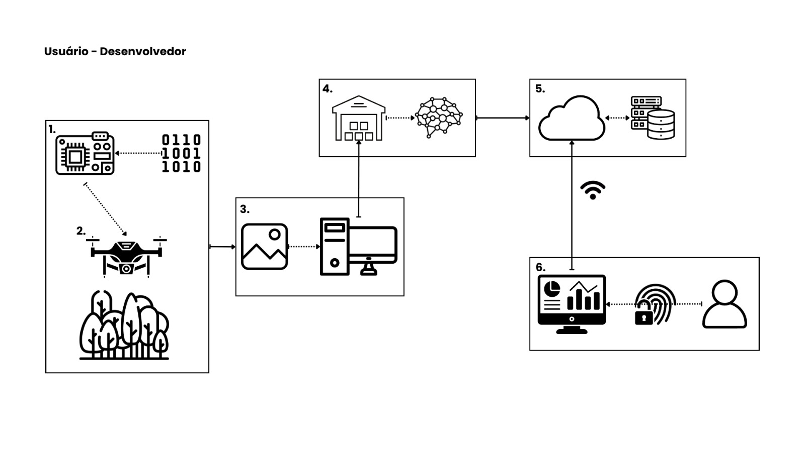

# Condições de implementação: Protótipos e Guias de Utilização

Durante o desenvolvimento do projeto, foi projetada uma arquitura de solução que fosse condizente com as condições de implementação da ideia proposta. Como o foco do projeto não está na implementação de um frontend complexo, mas sim na implementação de uma arquitetura robusta e escalável, utilizamos os **princípios de design de interação** para refletir nas **Condições de implementação** que elucidassem a melhor compreensão do usuário final de forma a facilitar a interação entre homem e máquina.

Para isso, precisamos ter uma noção clara das condições de implementação do projeto, que incluem a checagem do status atual do projeto (capacidade técnica, restrições de hardware, padrões e guidelines, performance e tempo de resposta, condições de rede, segurança e privacidade, etc.), para fazer o planejamento efetivo, definição e priorização de tarefas que atendam os requisitos, definição de prazos e status que permitam indicar as condições de implementação realistas.

## Introdução e contexto

No contexto do projeto, estamos inseridos num cenário de captura de imagens das árvores de uma floresta. Assim, a conectividade é um fator limitante e todos os dispositivos devem ter uma certa independência operacional. 
Por conta disso, algumas tarefas que auxiliem no atingimento dos requisitos funcionais e não funcionais devem ser priorizadas e, de alguma forma, ter seu status continuamente monitorado para que haja a continuidade fluida dos trabalhos. Nesse contexto, consideramos os seguintes status para cada tarefa:

- ***Todo***: Quando a execução de uma tarefa ainda não foi iniciada. No momento em que ela é concebida até o momento de atribuição a um responsável, ela habita neste quadrante.
- ***In Progress***: Quando começa o desenvolvimento efetivo dos tópicos e subtópicos. Aqui, entram o desenvolvimento de documentos, artefatos de código, apresentações, rascunhos e qualquer produção literal que possa ser utilizada e documentada posteriormente.
- ***Review***: Período de Revisão do grupo, em que pelo menos mais um integrante deve conferir e revisar o que foi produzido e atestar sua qualidade como entregável. Uma tarefa que não atenda a estes critérios (que podem variar dependendo do que foi feito) pode voltar ao “In Progress”.
- ***Done***: Quando a tarefa foi entregue com certo padrão de qualidade.

Todas as tarefas são subpartes de um todo maior, que é a entrega do projeto. Assim, a conclusão de cada tarefa é um passo para a conclusão do projeto como um todo, o qual deve fazer sentido para o usuário final.

## Princípios de design de interação

Como possuímos diversos perfis de usuários, como foi mapeado durante as Sprints anteriores em momentos distintos (confecção de Personas e Integrações com Stakeholders), é importante que a aplicação seja intuitiva e de fácil compreensão para todos os usuários.

Pensando nisso, focamos nos princípios de Visibilidade e aprendizado facilitado para traduzir ideias e conceitos de forma clara e objetiva, de modo que o usuário possa compreender o funcionamento da aplicação de forma intuitiva.

Observe também que uma estratégia empregada por nós para a construção de imagens e diagramas foi a utilização dos conceitos da ***Gestalt[^1]*** para proporcionar uma maior facilidade de compreensão. Elementos que pertencem a um mesmo processo estão agrupados e fechados em si, de forma que as setas que os interligam dão uma perspectiva de continuidade. Além disso, a forma como as figuras foram distribuídas entregam o fator de unidade.

## Protótipos & Guias de Utilização

Para facilitar a compreensão do usuário final, criamos um guia de utilização que descreve o passo a passo para a utilização da aplicação. Os guias foram elaborados de forma clara e objetiva, com imagens ilustrativas que auxiliam na compreensão do usuário.

Como a visualização dos dados é um dos principais pontos para a compreensão do usuário, criamos protótipos de telas que representam a interação do usuário com a aplicação. Para isso, utilizamos a ferramenta Figma para a criação dos protótipos. Apesar disso, o foco principal do projeto é a implementação da arquitetura de solução, e não a criação de um frontend complexo.

Para facilitar o olhar mais holístico da aplicação, utilizamos a estrutura de Reference Model of Open Distributed Processing (RM-ODP) para a criação de diagramas simplificados que explicam o sistema macro como um todo.

As legendas abaixo referem-se a cada parte do diagrama:

1. Utilizamos microprocessadores como estrutura acoplada ao drone para realizar a captura de fotos. Esses componentes são adicionados ao drone que sobrevoará a floresta.
2. Captura e envio de imagens para uma camada de processamento em borda - perto do local - onde as imagens serão recebidas e posteriormente endereçadas para o modelo de visão computacional.
3. Recebimento e encaminhamento das imagens.
4. Armazenamento e execução do modelo de visão computacional para gerar os resultados de contagem e outros status relevantes.
5. Armazenamento desses resultados em nuvem.
6. Consumo dessas informações pelo usuário utilizando ferramentas de visualização simplificadas.

## Fluxo da aplicação

Preparamos um fluxo da aplicação para que haja o entendimento completo dos processos que ocorrem na aplicação.
O diagrama do fluxo mostra a interação entre os diferentes componentes do sistema Para isso, utilizamos o Figma para a criação do diagrama:

- Frontend: A interface com o usuário final, onde os dados monitorados podem ser visualizados. Aqui, o usuário pode consultar as áreas monitoradas e obter informações sobre o estado atual das árvores.
- Backend: O backend é responsável por gerenciar as solicitações feitas pela interface frontend, buscando os dados no banco de dados e enviando-os de volta para a visualização.
- Banco de Dados: Onde todas as informações processadas e monitoradas são armazenadas.
- ETL (Extract, Transform, Load): Esta camada é responsável pela ingestão de dados processados, transformando-os em informações úteis que podem ser armazenadas e visualizadas.
- Edge Layer: Camada de processamento que opera nas bordas da rede, responsável por processar os dados dos drones e garantir sua integridade antes do envio ao backend.

[^1]: [As Leis da Gestalt Aplicadas ao Design de Interfaces](https://brasil.uxdesign.cc/as-leis-da-gestalt-aplicadas-ao-design-de-interfaces-efc480dc06ec)