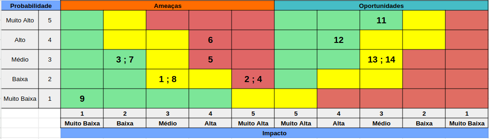

# Análise de Riscos

A análise de riscos é um processo fundamental para identificar, avaliar e mitigar potenciais ameaças e incertezas que podem impactar o sucesso e a sustentabilidade de uma empresa. Trata-se de uma prática proativa que visa antecipar cenários adversos, permitindo que as organizações estejam preparadas para lidar com desafios e tomar decisões informadas.

## Matriz de Risco

A Matriz de Risco é uma ferramenta que auxilia na identificação e avaliação de riscos em um projeto. Ela é composta por uma matriz de dupla entrada, na qual os riscos são classificados de acordo com sua probabilidade de ocorrência e impacto no projeto. A partir dessa classificação, é possível priorizar os riscos e definir estratégias para mitigá-los. No contexto do projeto, projetamos a seguinte matriz de risco:

| n°  | Risco                                                                              | Contingência                                                                                                      |
| --- | -------------------------------------------------------------------------------------------------- | ------------------------------------------------------------------------------------------------------------------------------------------ |
| 1   | Autonomia e alcance insuficientes do drone para cobrir toda a área desejada                         | Avaliar o tamanho da área a ser mapeada e utilizar drones/baterias de maior autonomia.                                                      |
| 2   | Danos aos equipamentos durante o sobrevoo por colisões ou obstáculos inesperados                    | Mapear obstáculos previamente e usar rotas alternativas, além de realizar manutenção preventiva nos drones.                                 |
| 3   | Condições climáticas adversas (chuva, neblina, ventos fortes)                                       | Monitorar o clima em tempo real e adiar missões até que as condições estejam favoráveis.                                                    |
| 4   | Tomada de controle forçada dos equipamentos por hackers ou interferências                           | Implementar segurança cibernética robusta com criptografia e autenticação multifator, além de manter atualizações regulares.                 |
| 5   | Vazamento de dados de clientes e colaboradores                                                      | Implementar políticas de segurança da informação alinhadas à LGPD com backups seguros e criptografia em todas as fases de dados.             |
| 6   | Falha do modelo de contagem de árvores, gerando dados inconsistentes                                | Aperfeiçoar o treinamento contínuo do modelo com novos dados e validações periódicas para garantir precisão.                                 |
| 7   | Indisponibilidade de rede prejudicando a comunicação entre dispositivos e sistemas                  | Investir em infraestrutura com redundâncias, como redes de satélite ou comunicação de rádio para garantir conectividade em áreas remotas.    |
| 8   | Falha no provedor de serviços em nuvem                                                              | Distribuir o sistema entre múltiplos provedores e zonas de disponibilidade para minimizar o impacto de falhas.                              |
| 9   | Dificuldade na interpretação e visualização dos resultados gerados pelos modelos                    | Desenvolver interfaces intuitivas, oferecendo ferramentas de visualização acessíveis e dashboards personalizáveis.                           |
| 10  | Armazenamento insuficiente nos dispositivos, prejudicando o processamento em campo                  | Planejar a capacidade de armazenamento e implementar sistemas de compressão e transferência automática para a nuvem.                        |

Além disso, mapeamos algumas oportunidades que podem ser valiosas para o projeto, caso sejam exploradas adequadamente. São elas:

| n°  | Oportunidade | Observação                                                                                                      |
| --- | -------------------------------------------------------------------------------------------------- | ------------------------------------------------------------------------------------------------------------------------------------------ |
| 11  | Redução de dependência de certificadoras externas (ex.: VERRA)                                      | Diminui custos e aumenta a autonomia operacional ao adotar processos automatizados e internalizados.                                         |
| 12  | Automação do processo de contagem de árvores, reduzindo tempo e custos operacionais                 | Acelera a coleta de dados, reduzindo a necessidade de intervenção manual e otimizando o uso de recursos humanos.                            |
| 13  | Geração de novos insights e estratégias a partir da análise de dados                                | A tecnologia de visão computacional pode revelar padrões e tendências que auxiliem decisões estratégicas.                                   |
| 14  | Integração com sistemas de transações para validação de créditos de carbono                         | A integração com sistemas financeiros acelera o processo de validação de créditos de carbono, aumentando o valor percebido pelo mercado.     |

