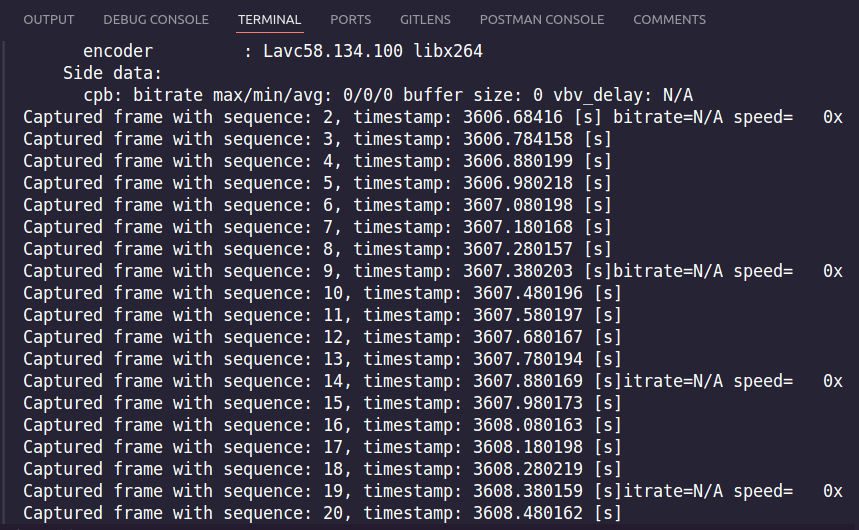
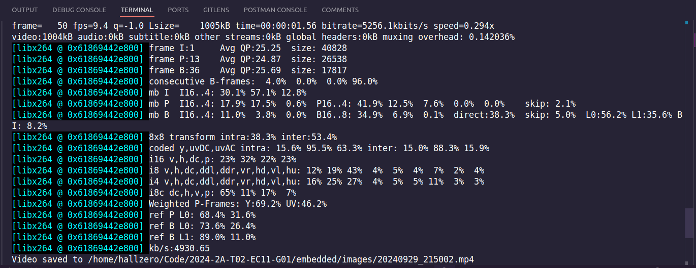
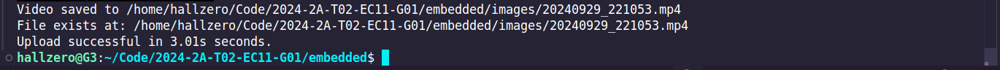
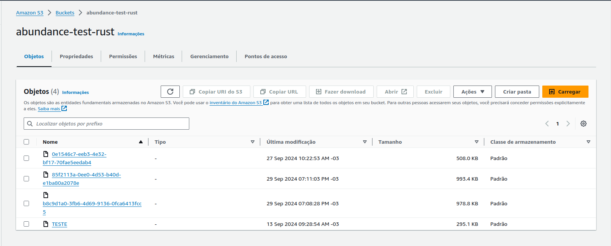

# Modelos, Definição e Preparação de Testes

Entendemos que a execução de testes é fundamental para garantir a funcionalidade de qualquer sistema. Dessa forma, a equipe focou em elencar as funcionalidades do sistema e definir os testes necessários para garantir a qualidade do produto final. Nesse sentido, obtivemos os seguintes vislumbres:

| Funcionalidade           | Testes Realizáveis                                                                 |
|--------------------------|------------------------------------------------------------------------------------|
| **Câmera**               | - Captura da imagem                                                                |
|                          |    - Captou a imagem? (S/N) ✅                                                     |
|                          |    - Em quanto tempo? (s/min/h) ✅                                                 |
|                          | - Aglutinação do vídeo                                                             |
|                          |    - Porcentagem de completude do vídeo? (%) ✅                                    |
|                          |    - Em quanto tempo? (s/min/h)  ✅                                                |
|                          | - Envio para a AWS                                                                 |
|                          |    - Enviou os arquivos (S/N) ✅                                                   |
|                          |    - Em quanto tempo? (s/min/h) ✅                                                 |
| **Modelo**               | - Recebimento da imagem                                                            |
|                          |    - Recebeu a imagem? (S/N)                                                       |
|                          |    - Em quanto tempo? (s/min/h)                                                    |
|                          | - Processamento da imagem                                                          |
|                          |    - Quais recursos foram utilizados? (cpu/gpu/ram)                                |
|                          |    - Quanto dos recursos foram utilizados? (% da capacidade computacional total)    |
|                          |    - Em quanto tempo? (s/min/h)                                                    |
|                          |    - A imagem foi distorcida? (Comparação do shape)                                |
|                          |    - Teste de acurácia do modelo (Comparar modelo com sanity check)                |
|                          | - Envio dos dados para o backend                                                   |
|                          |    - Enviou os dados? (S/N)                                                        |
|                          |    - Em quanto tempo? (s/min/h)                                                    |
| **Back**                 | - Recebimento dos dados pelo modelo                                                |
|                          |    - Recebeu os dados? (S/N)                                                       |
|                          |    - A quantidade de dados está coerente com a enviada pelo modelo?                |
|                          |    - Em quanto tempo? (s/min/h)                                                    |
|                          | - Guarda de dados em banco de dados                                                |
|                          |    - Em quanto tempo? (s/min/h)                                                    |
|                          | - Envio dos dados do modelo para o front                                           |
|                          |    - Enviou os dados? (S/N)                                                        |
|                          |    - Em quanto tempo? (s/min/h)                                                    |
| **Front**                | - Consumo dos dados                                                                |
|                          |    - Recebeu os dados? (S/N)                                                       |
|                          |    - A quantidade de dados está coerente com a enviada pelo backend?               |
|                          | - Visualização                                                                     |
|                          |    - Quantos gráficos foram construídos corretamente? (%)                          |
|                          | - Requisições por segundo: Métricas de quantidade de requisições que o sistema aguenta |

## Testes com a Câmera

### Captura da Imagem

Como a captação de imagens é crucial para o funcionamento do sistema, performamos alguns testes para garantir que a câmera está funcionando corretamente e informar ao operador sobre o status da captura para que assim algum feedback possa ser dado. Nesse contexto, aplicamos testes de sequências de frames capturados e velocidade de processamento.

### Aglutinação do Vídeo

Para garantir que o vídeo está sendo capturado corretamente, realizamos testes para verificar a porcentagem de completude do vídeo e o tempo de captura. Dessa forma, podemos garantir que o vídeo está sendo capturado corretamente e que o tempo de captura está dentro do esperado, retornando uma análise técnica dos frames sendo codificados em vídeo.

Neste exemplo:

- **Frame rate**: 50 fps (frames por segundo), que é uma taxa alta para vídeos de alta qualidade.
- **Tempo de duração**: O tempo total do vídeo é mostrado como aproximadamente 1.56 segundos.
- **Tamanho do vídeo**: O tamanho do arquivo final do vídeo é de 1005 kB.
- **Taxa de bits (bitrate)**: 5256.1 kbits/s, o que sugere uma alta taxa de compressão para vídeo.
- **Análise de macroblocos (MB)**: Há informações detalhadas sobre a estrutura de macroblocos (MB) no vídeo, mostrando a porcentagem de macroblocos intra, inter e o uso de transformações 8x8, o que é comum em vídeos comprimidos para eficiência.

Além disso, ao final do processo, o operador recebe um feedback sobre o status da captura do vídeo, informando se o vídeo foi capturado corretamente e em quanto tempo para ser enviado para o serviço de cloud. Podemos conferir, no próprio console da AWS, que o vídeo foi enviado corretamente. Neste caso, é o arquivo com o tamanho de 993.4 kB, que foi o indicado pelo terminal.

## Roadmap de Testes

Entendemos que o planejamento, definição e preparação de testes são fundamentais para garantir a qualidade do produto final. Entretanto, devido ao tempo limitado e à complexidade do sistema, optamos por focar em testes de integração e aceitação, que são essenciais para garantir o funcionamento correto do sistema como um todo. Nesse sentido, recomendamos que a implementação dos outros tipos de testes, como testes unitários e de regressão, seja realizada em fases posteriores do projeto, à medida que o sistema evolui e novas funcionalidades são adicionadas.