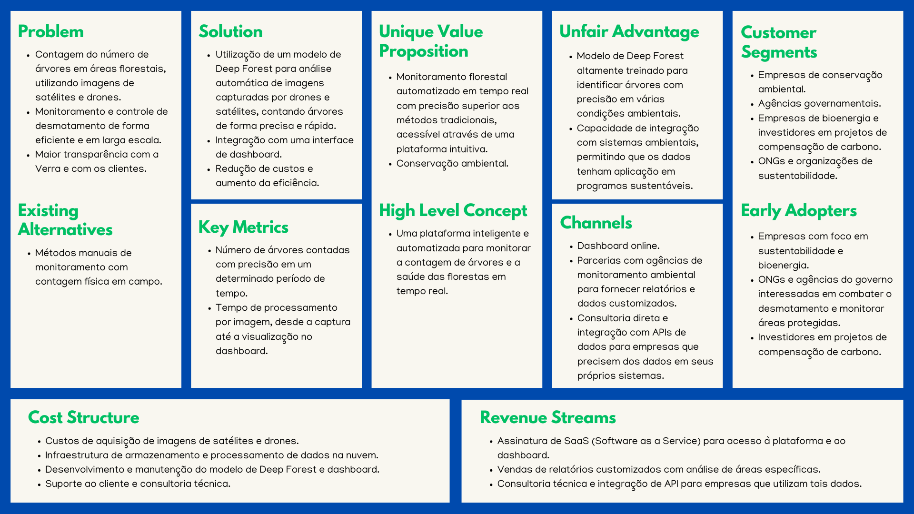

O Business Model Canvas é uma ferramenta estratégica que nos permite visualizar e estruturar os principais componentes do modelo de negócios do projeto de contagem de árvores utilizando o modelo de Deep Forest. Esse projeto visa automatizar o monitoramento de áreas florestais, oferecendo uma solução eficiente e precisa para a contagem de árvores a partir de imagens capturadas por drones e satélites.

Este Canvas abrange nove áreas essenciais, desde a definição dos segmentos de clientes até a estrutura de custos e as fontes de receita. Ele fornece uma visão clara de como o projeto agrega valor aos clientes, quais recursos e atividades são necessários para o funcionamento eficaz da solução e como ela se diferencia das alternativas existentes no mercado.

Ao analisar cada seção do Business Model Canvas, podemos compreender melhor como esse projeto está estruturado para atender às demandas de sustentabilidade e conservação ambiental, garantindo um modelo de negócio robusto, escalável e alinhado com as tendências globais de preservação dos ecossistemas florestais.

